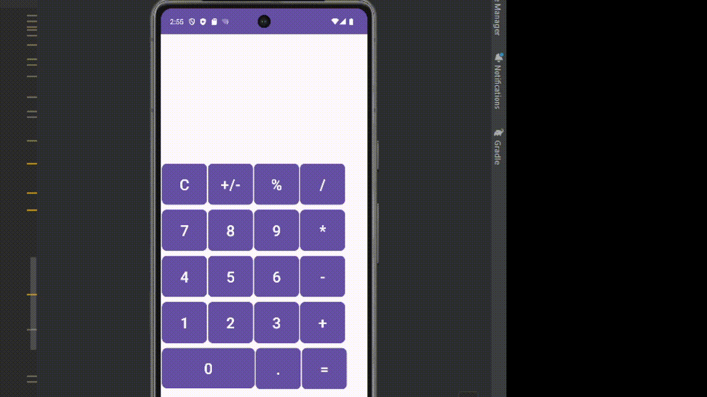

# Project Name

Calculator App

An android app that acts as a basic calculator

## Functionality 

The following **required** functionality is completed:

* [ ] User sees ...
- Top text box that displays current operating number or result number
* [ ] User can ...
- perform basic addition, subtraction, multiplcation, division, percentage, sign flip, display clearing, decimal operations

The following **extensions** are implemented:

No extensions

## Video Walkthrough

Here's a walkthrough of implemented user stories:

## Notes

Describe any challenges encountered while building the app.

- little familiarity with kotlin, android studio, mostly everything. Lots of online resources were needed. Felt unprepared
- taking into account both decimal and integer operations

## License

    Copyright 2023 Grayson Clark

    Licensed under the Apache License, Version 2.0 (the "License");
    you may not use this file except in compliance with the License.
    You may obtain a copy of the License at

        http://www.apache.org/licenses/LICENSE-2.0

    Unless required by applicable law or agreed to in writing, software
    distributed under the License is distributed on an "AS IS" BASIS,
    WITHOUT WARRANTIES OR CONDITIONS OF ANY KIND, either express or implied.
    See the License for the specific language governing permissions and
    limitations under the License.
